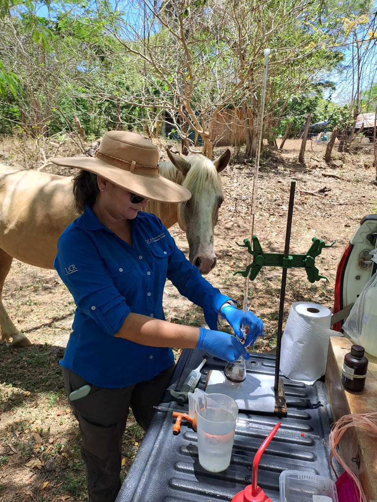

# SUSANA BRICEÑO GUEVARA

Investigadora del [Centro de Investigacion en Contaminación Ambiental](https://cica.ucr.ac.cr/)

 

## Áreas de investigación
- Contaminantes orgánicos
- Contaminantes emergentes
- Toxinas marinas
- Isotopos estables ambientales

## Webinar impartidos

Ciencia para vos [Uso de isótopos estables y técnicas convencionales](https://www.youtube.com/watch?v=JpgvdF8s2EA)

